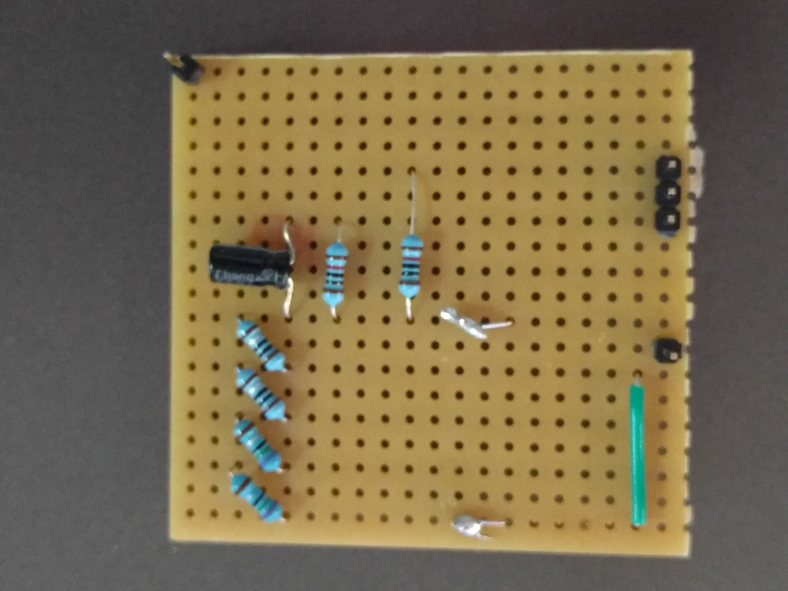
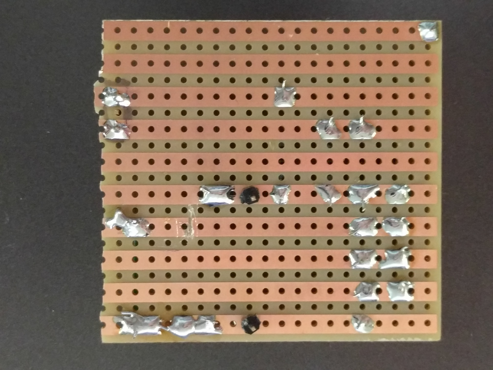
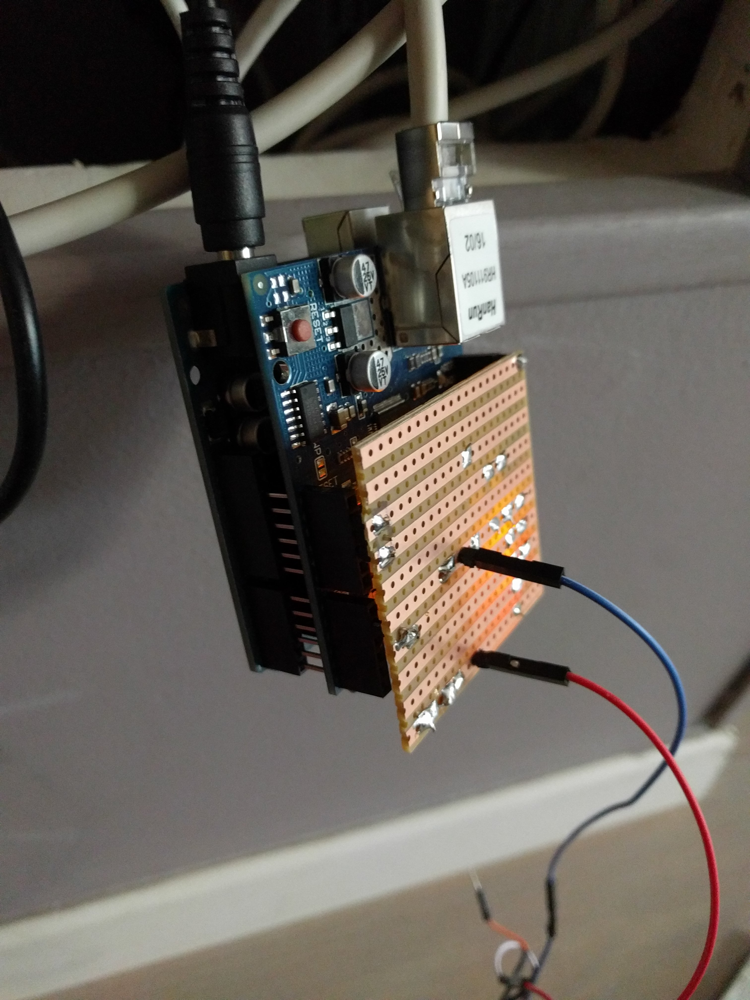

Electricity Monitoring
======================

Presentation
------------

This is a minimalist but functional project to graph my in-house
electricity consumption, inspired by `Citizen Watt
<http://www.citizenwatt.paris>`_, and `Open Energy Monitor
<https://openenergymonitor.org/>`_.

Needed material
---------------

You'll need:

- A current transformer (CT), I used a `SCT-013-000
  <https://www.amazon.fr/gp/product/B00J2N4NC2/ref=oh_aui_detailpage_o05_s00?ie=UTF8&psc=1>`_.
- An Arduino (I used a UNO R3).
- An Ethernet shield (I used A `SunFounder Ethernet Shield W5100
  <https://www.amazon.fr/gp/product/B00HG82V1A/ref=oh_aui_detailpage_o08_s00?ie=UTF8&psc=1>`_).
- A female jack plug (I found one in an old drawer…).
- 1 × 18 Ohms resistor.
- 2 × 10k Ohm resistors (or any equal value resistor pair up to 470k Ohm).
- 1 × 10uF capacitor.
- 1 breadboard.

How it works
------------

The AC transformer, installed on a cable you want to measure,
transforms the intensity to another intensity (ratio of 100A:50mA).

Considering the AC as an intensity generator proportional to the
measured current, by using a resistor we get a voltage proportional to
the intensity. Measuring a volteage is easy with an Arduino, we just
need it to be in the range [0; 5] volts. This resistor, in this usage,
is commonly called a "burden resistor".

Setup
-----

`From OpenEnergyMonitor
<https://learn.openenergymonitor.org/electricity-monitoring/ct-sensors/how-to-build-an-arduino-energy-monitor-measuring-current-only>`_,
here is the setup I used:

.. image:: https://learn.openenergymonitor.org/electricity-monitoring/ct-sensors/files/currentOnly_bb.png

I used a female jack plug to nicely connect the CT to my breadboard,
next upgrade is to solder this to a strip board.

Next step is to find a cable for the CT, but for you safety follow
those instructions carefully:

- Powering off the installation you want to measure, if it's your
  whole house, just power off the whole house.

- Never trust a circuit breaker label, so *do measure* the voltage
  of the installation you want to touch before actually touching it.

- If you have any doubts, seek professional assistance.

- Search a single-core cable, not a twin-core one, in which case the
  currents flowing in both direction will cancel each-other and your
  measure will be zero.

- Ensure the burden resistor is connected to your CT: Don't clip a CT
  without its burden resistor, it will accumulate dangerous voltages
  (the SCT-013-000 has a zener diode but still, don't do it).

- Check for exposed bare conductors, if there are ones, you
  installation is probably illegal → seek for professional assitance
  about this subject.

- Never attempt to fit a C.T. to a bare conductor, in other words,
  don't trust the insulation of the CT, if it fails, you can get hurt.

- Clip the CT around the cable you want to measure.

- Power on this section again.

Once the setup complete, you should probably assign an IP for the
arduino in your DHCP server so you can find it easily, and start
querying it::

   $ curl 10.0.0.20
   {"amp": 1.35, "watt": 323.98}

From here, you may install `InfluxDB` and `grafana`, and use the
python script in a cron like::

   * * * * * /usr/bin/python3 /home/mdk/.local/bin/query_watt.py 10.0.0.20 global 127.0.0.1:8086 conso

To fetch from the arduino and push to
InfluxDB, from here you should get:

.. image:: https://mdk.fr/consom.png

About using a Raspberry PI
--------------------------

It should be possible to use a Raspberry PI instead of an Arduino, but
you'll need an analog input, the Raspberry PI doesn't have one, so
you'll need an ADC.

Using a stripboard
------------------

As the circuit is simple, it's possible to make it on a stripboard as
an arduino shell, I did mine like this (yes the bottom left blob is a
fix, I wrongly cut the line):

And it mounts nicely like this:

